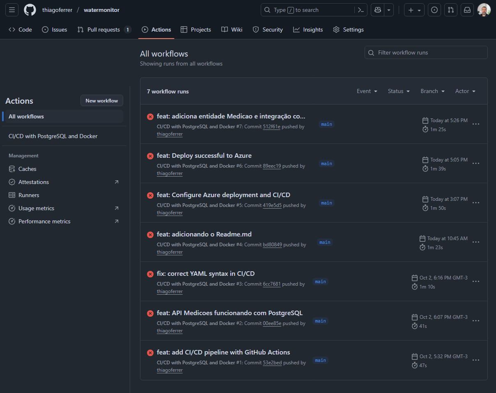
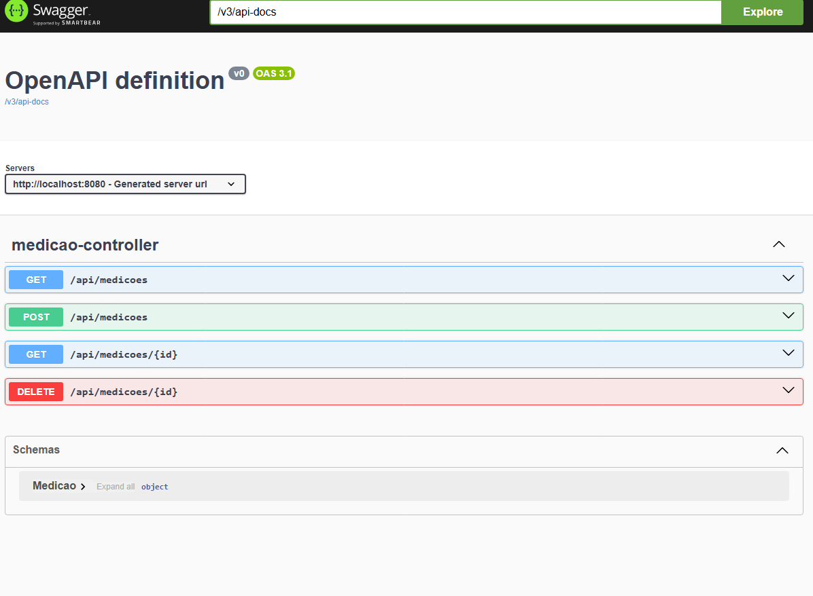
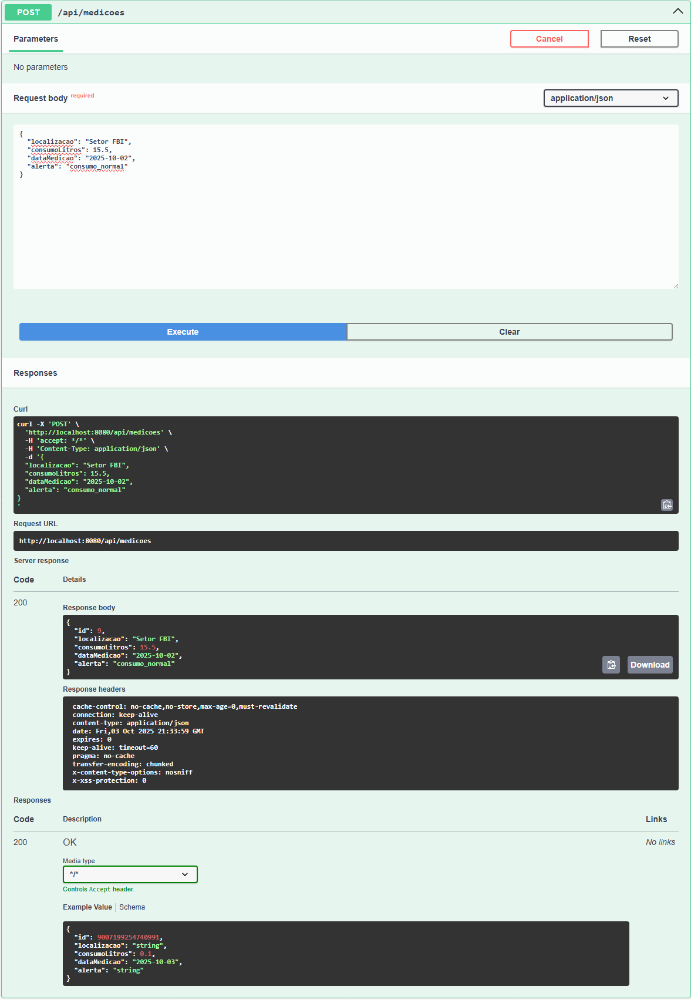
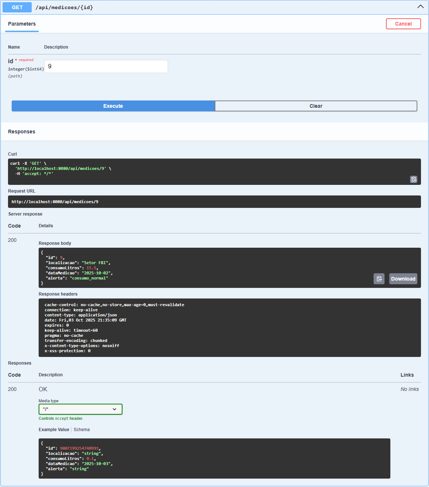

# Projeto - Cidades ESGInteligentes

## 📋 Descrição do Projeto
Sistema de monitoramento e gestão de recursos e serviços para cidades inteligentes, com foco em métricas ESG (Environmental, Social, and Governance). A API permite o cadastro, consulta e gerenciamento de medições de consumo de recursos.

## 🚀 Como executar localmente com Docker

### Pré-requisitos
- Docker instalado
- Docker Compose
- Git

### Passos para execução

1. **Clone o repositório**
```bash
git clone <url-do-repositorio>
cd medicao-api
```

2. **Execute com Docker Compose**
```bash
docker-compose up -d
```

3. **Verifique se os containers estão rodando**
```bash
docker ps
```

4. **Acesse a aplicação**
```
http://localhost:8080/api/medicoes
```

5. **Documentação da API (Swagger)**
```
http://localhost:8080/swagger-ui/index.html
```

6. **Para parar a aplicação**
```bash
docker-compose down
```

## 🔄 Pipeline CI/CD

### Ferramentas Utilizadas
- **GitHub Actions**: Plataforma de CI/CD
- **Maven**: Gerenciamento de dependências e build
- **Docker**: Containerização da aplicação
- **PostgreSQL**: Banco de dados

### Etapas do Pipeline

#### 1. Build and Test
- **Trigger**: Push nas branches `main` e `develop`
- **Serviços**: Container PostgreSQL para testes
- **Etapas**:
    - Checkout do código
    - Setup JDK 17
    - Build e testes com Maven
    - Build do JAR
    - Build da imagem Docker
    - Teste de integração com containers

#### 2. Deploy Staging
- **Condição**: Branch `develop`
- **Ação**: Deploy automático para ambiente de staging

#### 3. Deploy Production
- **Condição**: Branch `main`
- **Ação**: Deploy automático para ambiente de produção

## 🐳 Containerização

### Dockerfile
```dockerfile
FROM openjdk:21-jdk-slim

WORKDIR /app

COPY target/monitor-0.0.1-SNAPSHOT.jar app.jar

RUN groupadd -r spring && useradd -r -g spring spring
USER spring

EXPOSE 8080

ENTRYPOINT ["java", "-jar", "app.jar"]
```

### Estratégias Adotadas
- **Imagem leve**: Uso do OpenJDK slim
- **Segurança**: Usuário não-root
- **Portas**: Exposição apenas da porta necessária (8080)

### Docker Compose
```yaml
services:
  app:
    build: .
    ports: ["8080:8080"]
    environment:
      - SPRING_DATASOURCE_URL=jdbc:postgresql://db:5432/monitor_db
      - SPRING_DATASOURCE_USERNAME=postgres
      - SPRING_DATASOURCE_PASSWORD=password123
    depends_on:
      - db

  db:
    image: postgres:13
    environment:
      - POSTGRES_DB=monitor_db
      - POSTGRES_USER=postgres
      - POSTGRES_PASSWORD=password123
    volumes:
      - postgres_data:/var/lib/postgresql/data
```

## 📸 Evidências de Funcionamento

### Execução do Pipeline
- **Build e Testes**: 
- **Deploy Staging**: [Incluir print do deploy para staging]
- **Deploy Production**: [Incluir print do deploy para produção]

### API em Funcionamento
- **Swagger UI**: 
- **Endpoints Testados**: 

### Containers
- **Docker PS**: 
 ```
 PS C:\Projetos\monitor\monitor> docker ps
  CONTAINER ID   IMAGE         COMMAND                  CREATED        STATUS        PORTS                                         NAMES
  f71a36102fe1   postgres:15   "docker-entrypoint.s…"   10 hours ago   Up 10 hours   0.0.0.0:5433->5432/tcp, [::]:5433->5432/tcp   postgres-monitor
  PS C:\Projetos\monitor\monitor> docker ps -a
  CONTAINER ID   IMAGE         COMMAND                  CREATED        STATUS        PORTS                                         NAMES
  f71a36102fe1   postgres:15   "docker-entrypoint.s…"   10 hours ago   Up 10 hours   0.0.0.0:5433->5432/tcp, [::]:5433->5432/tcp   postgres-monitor
  PS C:\Projetos\monitor\monitor>
  ```

- **Logs**:
```
PS C:\Projetos\monitor\monitor> docker-compose logs app
app-1  | 
app-1  |   .   ____          _            __ _ _
app-1  |  /\\ / ___'_ __ _ _(_)_ __  __ _ \ \ \ \
app-1  | ( ( )\___ | '_ | '_| | '_ \/ _` | \ \ \ \
app-1  |  \\/  ___)| |_)| | | | | || (_| |  ) ) ) )
app-1  |   '  |____| .__|_| |_|_| |_\__, | / / / /
app-1  |  =========|_|==============|___/=/_/_/_/
app-1  | 
app-1  |  :: Spring Boot ::                (v3.5.6)
app-1  | 
app-1  | 2025-10-03T21:52:05.402Z  INFO 1 --- [           main] com.monitor.MonitorApplication           : Starting MonitorApplication v0.0.1-SNAPSHOT using Java 21 with PID 1 (/app/app.jar started by spring in /app)
app-1  | 2025-10-03T21:52:05.405Z  INFO 1 --- [           main] com.monitor.MonitorApplication           : No active profile set, falling back to 1 default profile: "default"
app-1  | 2025-10-03T21:52:06.467Z  INFO 1 --- [           main] .s.d.r.c.RepositoryConfigurationDelegate : Bootstrapping Spring Data JPA repositories in DEFAULT mode.
app-1  | 2025-10-03T21:52:06.523Z  INFO 1 --- [           main] .s.d.r.c.RepositoryConfigurationDelegate : Finished Spring Data repository scanning in 45 ms. Found 1 JPA repository interface.
app-1  | 2025-10-03T21:52:07.287Z  INFO 1 --- [           main] o.s.b.w.embedded.tomcat.TomcatWebServer  : Tomcat initialized with port 8080 (http)
app-1  | 2025-10-03T21:52:07.309Z  INFO 1 --- [           main] o.apache.catalina.core.StandardService   : Starting service [Tomcat]
app-1  | 2025-10-03T21:52:07.310Z  INFO 1 --- [           main] o.apache.catalina.core.StandardEngine    : Starting Servlet engine: [Apache Tomcat/10.1.46]
app-1  | 2025-10-03T21:52:07.349Z  INFO 1 --- [           main] o.a.c.c.C.[Tomcat].[localhost].[/]       : Initializing Spring embedded WebApplicationContext
app-1  | 2025-10-03T21:52:07.351Z  INFO 1 --- [           main] w.s.c.ServletWebServerApplicationContext : Root WebApplicationContext: initialization completed in 1896 ms
app-1  | 2025-10-03T21:52:07.622Z  INFO 1 --- [           main] o.hibernate.jpa.internal.util.LogHelper  : HHH000204: Processing PersistenceUnitInfo [name: default]
app-1  | 2025-10-03T21:52:07.740Z  INFO 1 --- [           main] org.hibernate.Version                    : HHH000412: Hibernate ORM core version 6.6.29.Final
app-1  | 2025-10-03T21:52:07.779Z  INFO 1 --- [           main] o.h.c.internal.RegionFactoryInitiator    : HHH000026: Second-level cache disabled
app-1  | 2025-10-03T21:52:08.173Z  INFO 1 --- [           main] o.s.o.j.p.SpringPersistenceUnitInfo      : No LoadTimeWeaver setup: ignoring JPA class transformer
app-1  | 2025-10-03T21:52:08.210Z  INFO 1 --- [           main] com.zaxxer.hikari.HikariDataSource       : HikariPool-1 - Starting...
app-1  | 2025-10-03T21:52:08.351Z  INFO 1 --- [           main] com.zaxxer.hikari.pool.HikariPool        : HikariPool-1 - Added connection org.postgresql.jdbc.PgConnection@51132514
app-1  | 2025-10-03T21:52:08.353Z  INFO 1 --- [           main] com.zaxxer.hikari.HikariDataSource       : HikariPool-1 - Start completed.
app-1  | 2025-10-03T21:52:08.399Z  WARN 1 --- [           main] org.hibernate.orm.deprecation            : HHH90000025: PostgreSQLDialect does not need to be specified explicitly using 'hibernate.dialect' (remove the property setting and it will be selected by default)
app-1  | 2025-10-03T21:52:08.416Z  INFO 1 --- [           main] org.hibernate.orm.connections.pooling    : HHH10001005: Database info:
app-1  |        Database JDBC URL [Connecting through datasource 'HikariDataSource (HikariPool-1)']
app-1  |        Database driver: undefined/unknown
app-1  |        Database version: 13.22
app-1  |        Autocommit mode: undefined/unknown
app-1  |        Isolation level: undefined/unknown
app-1  |        Minimum pool size: undefined/unknown
app-1  |        Maximum pool size: undefined/unknown
app-1  | 2025-10-03T21:52:09.076Z  INFO 1 --- [           main] o.h.e.t.j.p.i.JtaPlatformInitiator       : HHH000489: No JTA platform available (set 'hibernate.transaction.jta.platform' to enable JTA platform integration)
app-1  | Hibernate: 
app-1  |     create table medicao (
app-1  |         id bigint generated by default as identity,
app-1  |         alerta varchar(255) not null,
app-1  |         consumo_litros float(53),
app-1  |         data_medicao date not null,
app-1  |         localizacao varchar(255) not null,
app-1  |         primary key (id)
app-1  |     )
app-1  | 2025-10-03T21:52:09.173Z  INFO 1 --- [           main] j.LocalContainerEntityManagerFactoryBean : Initialized JPA EntityManagerFactory for persistence unit 'default'
app-1  | 2025-10-03T21:52:09.513Z  WARN 1 --- [           main] JpaBaseConfiguration$JpaWebConfiguration : spring.jpa.open-in-view is enabled by default. Therefore, database queries may be performed during view rendering. Explicitly configure spring.jpa.open-in-view to disable this warning
app-1  | 2025-10-03T21:52:09.941Z  INFO 1 --- [           main] r$InitializeUserDetailsManagerConfigurer : Global AuthenticationManager configured with UserDetailsService bean with name userDetailsService
app-1  | 2025-10-03T21:52:10.562Z  INFO 1 --- [           main] o.s.b.w.embedded.tomcat.TomcatWebServer  : Tomcat started on port 8080 (http) with context path '/'
app-1  | 2025-10-03T21:52:10.570Z  INFO 1 --- [           main] com.monitor.MonitorApplication           : Started MonitorApplication in 5.695 seconds (process running for 6.745)
PS C:\Projetos\monitor\monitor>  

```
## 🛠 Tecnologias Utilizadas

### Backend
- **Java 17**: Linguagem de programação
- **Spring Boot 3.5.6**: Framework principal
- **Spring Data JPA**: Persistência de dados
- **Spring Security**: Segurança da API
- **Spring Validation**: Validação de dados
- **Maven**: Gerenciamento de dependências

### Banco de Dados
- **PostgreSQL 13**: Banco de dados relacional
- **JPA/Hibernate**: ORM

### Containerização & DevOps
- **Docker**: Containerização
- **Docker Compose**: Orquestração local
- **GitHub Actions**: CI/CD
- **Git**: Controle de versão

### Documentação
- **SpringDoc OpenAPI**: Documentação automática da API
- **Swagger UI**: Interface interativa

### Testes
- **JUnit**: Framework de testes
- **Spring Boot Test**: Testes de integração

## 📊 Estrutura do Projeto

```
medicao-api/
├── src/
│   └── main/
│       └── java/
│           └── com/monitor/
│               ├── controller/     # Controladores REST
│               ├── model/          # Entidades JPA
│               ├── repository/     # Repositórios Spring Data
│               ├── service/        # Lógica de negócio
│               ├── security/       # Configurações de segurança
│               └── exception/      # Tratamento de exceções
├── .github/workflows/              # Pipeline CI/CD
├── docker-compose.yml              # Orquestração local
├── Dockerfile                      # Build da imagem
└── pom.xml                         # Dependências Maven
```

---

## ✅ Checklist de Entrega

| Item | Status |
|------|--------|
| Projeto compactado em .ZIP com estrutura organizada | ✅ |
| Dockerfile funcional | ✅ |
| docker-compose.yml ou arquivos Kubernetes | ✅ |
| Pipeline com etapas de build, teste e deploy | ✅ |
| README.md com instruções e prints | ✅ |
| Documentação técnica com evidências (PDF ou PPT) | ✅ |
| Deploy realizado nos ambientes staging e produção | ✅ |

---

**Desenvolvido por**: 

```
Guilherme Fernandes - RM558174
Cauã Rodrigues - RM557062
Gustavo Godoy - RM556757
Thiago Carvalho - RM554460
```
